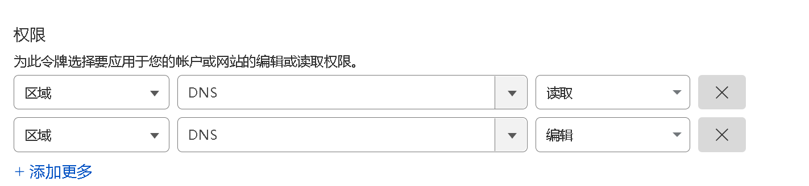

# Telegram Auto Switch DNS Bot

<div align="center">
  
</div>

[Telegram Auto Switch DNS Bot](https://github.com/reppoor/telegram-bot-ddns)

[telegram频道 t.me/ddns_reppoor](https://t.me/ddns_reppoor)

一个自动切换 DNS 记录的 Telegram 机器人，用于维护域名的连通性。当主域名无法访问时，自动切换到备用转发域名。

## 运行环境
- Ubuntu 22+
- CPU架构 x86_64

## 功能特性

- 可配置前后端分离
- 自动检测域名连通性
- 当主域名无法访问时，自动切换到备用转发域名
- 支持多种 DNS 记录类型 (A, CNAME)
- 通过 Telegram 机器人接收通知
- 支持 24 小时封禁不可用的转发域名
- 可配置的自动检测间隔

## 技术栈

- Go
- Telegram Bot API
- Cloudflare API
- SQLite/MySQL 数据库
- YAML 配置文件

## 配置说明

配置文件为 `conf.yaml`，主要配置项包括：

- Logger: 日志配置
- Start: 启动模式配置
- Backend URL: 后端 API 地址
- Auto Check: 自动检测配置
- Database: 数据库配置（如果需要使用MYSQL，请自行下载）
- Telegram: Telegram 机器人配置
- Cloudflare: Cloudflare API 配置

## 使用方法
<div align="center">
  
</div>

1. 前往 [Cloudflare API](https://dash.cloudflare.com/profile/api-tokens) 创建 Cloudflare API令牌，并给于DNS区域读写权限
2. [下载](https://github.com/reppoor/telegram-auto-switch-dns-bot/blob/master/conf.yaml) 配置 `conf.yaml` 文件，并将其放到与二进制文件的同目录下
3. [下载](https://github.com/reppoor/telegram-auto-switch-dns-bot/releases) 下载二进制文件
4. 运行程序 `./二进制文件名`
5. 通过 Telegram 机器人进行管理
6. 二进制文件需要通过
7. 如需后台运行请使用`systemd` 如果您的 Linux 服务器上尚未安装 systemd，可以使用包管理器`apt`来安装它`apt install systemd`


## 捐赠

#### 如果您觉得这个项目对您有帮助，欢迎进行捐赠：

USDT (TRC20): ``


## 项目目录结构

```
├── CheckBackend/          # 后端检测模块
│   └── check_api.go       # API检测逻辑
├── cloudflare/            # Cloudflare API相关功能
│   └── cloudflare.go      # Cloudflare DNS记录操作
├── cmd/                   # 程序入口
│   └── main.go            # 主程序入口
├── config/                # 配置模块
│   └── config.go          # 配置文件加载与解析
├── db/                    # 数据库模块
│   ├── models/            # 数据模型定义
│   │   ├── db_models.go   # 数据库模型
│   │   └── hooks.go       # 模型钩子函数
│   ├── operate/           # 数据库操作封装
│   │   ├── db_add.go      # 添加操作
│   │   ├── db_del.go      # 删除操作
│   │   ├── db_get.go      # 查询操作
│   │   └── db_up.go       # 更新操作
│   └── db.go              # 数据库初始化
├── middleware/            # 中间件
│   └── auth.go            # 认证中间件
├── telegram/bot/          # Telegram机器人功能
│   ├── admin_handlers.go  # 管理员命令处理器
│   ├── auto_check.go      # 自动检测功能
│   ├── bot.go             # 机器人实例
│   ├── check.go           # 检测逻辑
│   ├── commands.go        # 命令处理器
│   ├── dispatcher.go      # 消息分发器
│   ├── handlers.go        # 消息处理器
│   ├── init.go            # 初始化逻辑
│   ├── keyboards.go       # 键盘生成器
│   ├── register.go        # 注册流程
│   └── tool.go            # 工具函数
├── utils/                 # 工具模块
│   └── logger.go          # 日志工具
├── README.md              # 项目说明文件
├── conf.yaml              # 配置文件示例
├── go.mod                 # Go模块定义
└── go.sum                 # Go模块校验

```

# Stargazers over time
[](https://github.com/reppoor/telegram-auto-switch-dns-bot)